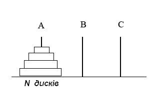

# Recursive functions, algorithms and examples of their application

## Task 1

Write a Python program that recursively copies files from a source directory, moves them to a new directory, and sorts them into subdirectories based on file extensions.

Also, consider the following conditions:

**1. Argument Parsing:**
The script should accept two command-line arguments: the path to the source directory and the path to the destination directory (by default, if the destination directory is not provided, it should be named dist).

**2. Recursive Directory Reading:**

- A function should be written that accepts a directory path as an argument.
- The function should iterate over all items in the directory.
- If an item is a directory, the function should call itself recursively for that directory.
- If an item is a file, it should be made available for copying.

**3. File Copying:**

- A new path in the destination directory should be created for each file type, using the file extension as the name of the subdirectory.
- Files of the corresponding type should be copied into the appropriate subdirectory.

**4. Exception Handling:**
The code should properly handle exceptions, such as file or directory access errors.

## Task 2

Write a Python program that uses recursion to create a "Koch snowflake" fractal, given that the user should be able to specify the level of recursion.

## Task 3 (Optional). Towers of Hanoi

Write a program that performs the movement of disks from rod `A` to rod `C`, using rod `B` as auxiliary. The disks have different sizes and are initially placed on the starting rod in decreasing order of size from top to bottom.



**Rules:**

Only one disk can be moved at a time.
`A` disk can only be placed on a larger disk or an empty rod.
The input to the program should be the number of disks
`𝑛` - on the initial rod. The output should log the sequence of steps to move the disks from rod `A` to rod `C`.

Example execution of the code for `𝑛 = 3`. On the initial rod, they are placed as follows: `[3, 2, 1]`, where `3` is the largest disk, and `1` is the smallest.

```python
Initial state: {'A': [3, 2, 1], 'B': [], 'C': []}
Move disk from A to C: 1
Intermediate state: {'A': [3, 2], 'B': [], 'C': [1]}
Move disk from A to B: 2
Intermediate state: {'A': [3], 'B': [2], 'C': [1]}
Move disk from C to B: 1
Intermediate state: {'A': [3], 'B': [2, 1], 'C': []}
Move disk from A to C: 3
Intermediate state: {'A': [], 'B': [2, 1], 'C': [3]}
Move disk from B to A: 1
Intermediate state: {'A': [1], 'B': [2], 'C': [3]}
Move disk from B to C: 2
Intermediate state: {'A': [1], 'B': [], 'C': [3, 2]}
Move disk from A to C: 1
Final state: {'A': [], 'B': [], 'C': [3, 2, 1]}
```
